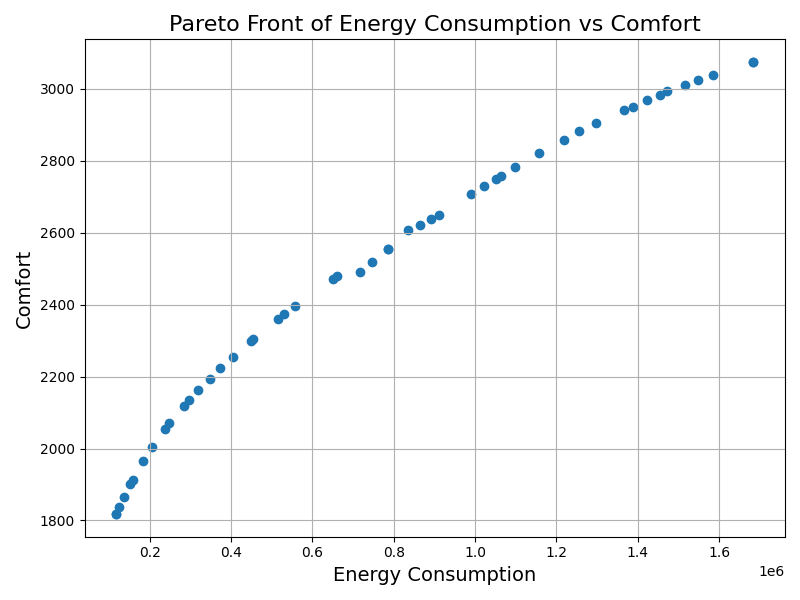

# Example

Case study with a simple heating system [SimpleHeatingSystem.mo](./SimpleHeatingSystem.mo) built in Modelica.

The idea is to heat a room, when the room heats faster, human beings feels more comfortable, but the energy consumption and cost become higher. This system should be optimized to find the **trade-off of energy consumption and comfort**.

hyperparameters (these are the parameters to be varied): 

```
  parameter Real Q_max = 5000 "Maximum heating power in watts";
  parameter Real T_set = 293.15 "Setpoint temperature in Kelvin";
```

### I. Generate Feature Tree/Model from A Modelica File (Optional)

1. Generate the parser code using ANTLR4

```
antlr4 -Dlanguage=Python3 modelica.g4
```

There are files which haven been generated, e.g.:
* `modelicaLexer.py`
* `modelicaParser.py`
* `modelicaListener.py`

2. Configuration

configurate `parse_modelica.py`

```python
# Configuration
file_name = 'SimpleHeatingSystem.mo'
```

configurate `feature_model.py`

```python
# Configuration
model_name = 'SimpleHeatingSystem.mo'
output_file = 'feature_model.json'
include_equations = True  # set to "False" if equations should be excluded
```

3. Parse the Modelica model and generate the feature tree

```
python feature_model.py
```

You will see the result in the terminal:

```
SimpleHeatingSystem
├── parameter Real (Q_max)
│   └── value=5000
├── parameter Real (T_set)
│   └── value=293.15
├── parameter Real (efficiency)
│   └── value=0.9
├── parameter Real (hysteresis)
│   └── value=0.5
├── parameter Real (T_comfort)
│   └── value=293.15
├── Real (Q_heat)
├── Real (T_room)
│   └── value=()
├── Real (cost)
│   └── value=()
├── Real (energy)
│   └── value=()
├── Real (comfort)
│   └── value=()
├── Boolean (heater_on)
│   └── value=()
├── constant Real (c_p)
│   └── value=1005
├── constant Real (m_air)
│   └── value=50
├── Real (accumulated_discomfort)
│   └── value=()
├── Equation 1: der(T_room)=(Q_heat*efficiency-(T_room-273.15))/(m_air*c_p)
├── Equation 2: heater_on=ifT_room<T_set-hysteresisthentrueelseifT_room>T_set+hysteresisthenfalseelsepre(heater_on)
├── Equation 3: Q_heat=ifheater_onthenQ_maxelse0
├── Equation 4: der(energy)=Q_heat*efficiency
├── Equation 5: der(cost)=0.1*Q_heat*efficiency
├── Equation 6: der(accumulated_discomfort)=abs(T_room-T_comfort)
└── Equation 7: der(comfort)=ifheater_onthenefficiency*Q_heat/(accumulated_discomfort+1)else0
```

The feature model will be then saved as `feature_model.json`:

```json
{
    "name": "SimpleHeatingSystem",
    "children": [
        {
            "name": "parameter Real (Q_max)",
            "children": [
                {
                    "name": "value=5000",
                    "children": []
                }
            ]
        },
        {
            "name": "parameter Real (T_set)",
            "children": [
                {
                    "name": "value=293.15",
                    "children": []
                }
            ]
        },
        {
            "name": "parameter Real (efficiency)",
            "children": [
                {
                    "name": "value=0.9",
                    "children": []
                }
            ]
        },
        {
            "name": "parameter Real (hysteresis)",
            "children": [
                {
                    "name": "value=0.5",
                    "children": []
                }
            ]
        },
        {
            "name": "parameter Real (T_comfort)",
            "children": [
                {
                    "name": "value=293.15",
                    "children": []
                }
            ]
        },
        {
            "name": "Real (Q_heat)",
            "children": []
        },
        {
            "name": "Real (T_room)",
            "children": [
                {
                    "name": "value=()",
                    "children": []
                }
            ]
        },
        {
            "name": "Real (cost)",
            "children": [
                {
                    "name": "value=()",
                    "children": []
                }
            ]
        },
        {
            "name": "Real (energy)",
            "children": [
                {
                    "name": "value=()",
                    "children": []
                }
            ]
        },
        {
            "name": "Real (comfort)",
            "children": [
                {
                    "name": "value=()",
                    "children": []
                }
            ]
        },
        {
            "name": "Boolean (heater_on)",
            "children": [
                {
                    "name": "value=()",
                    "children": []
                }
            ]
        },
        {
            "name": "constant Real (c_p)",
            "children": [
                {
                    "name": "value=1005",
                    "children": []
                }
            ]
        },
        {
            "name": "constant Real (m_air)",
            "children": [
                {
                    "name": "value=50",
                    "children": []
                }
            ]
        },
        {
            "name": "Real (accumulated_discomfort)",
            "children": [
                {
                    "name": "value=()",
                    "children": []
                }
            ]
        },
        {
            "name": "Equation 1: der(T_room)=(Q_heat*efficiency-(T_room-273.15))/(m_air*c_p)",
            "children": []
        },
        {
            "name": "Equation 2: heater_on=ifT_room<T_set-hysteresisthentrueelseifT_room>T_set+hysteresisthenfalseelsepre(heater_on)",
            "children": []
        },
        {
            "name": "Equation 3: Q_heat=ifheater_onthenQ_maxelse0",
            "children": []
        },
        {
            "name": "Equation 4: der(energy)=Q_heat*efficiency",
            "children": []
        },
        {
            "name": "Equation 5: der(cost)=0.1*Q_heat*efficiency",
            "children": []
        },
        {
            "name": "Equation 6: der(accumulated_discomfort)=abs(T_room-T_comfort)",
            "children": []
        },
        {
            "name": "Equation 7: der(comfort)=ifheater_onthenefficiency*Q_heat/(accumulated_discomfort+1)else0",
            "children": []
        }
    ]
}
```

### II. Run Optimization

1. Configurate global settings for the optimization

```python
# Basic settings
SIMULATION_STOP_TIME = 2000  # in seconds
MODEL_NAME = "SimpleHeatingSystem"
MODEL_FILE = f"{MODEL_NAME}.mo"

current_directory = os.getcwd()
model_path = os.path.join(current_directory, MODEL_FILE)

# Parameters and result variables
PARAMETERS = ["Q_max", "T_set"]
RESULTS = ["energy", "cost", "comfort"]

# Parameter bounds
PARAM_BOUNDS = {
    "Q_max": (1000, 5000),
    "T_set": (280, 310),
}

# Algorithm selection
# Options: 'pymoo.NSGA2', 'pymoo.NSGA3', 'pymoo.CMAES', 'scipy.de', 'scipy.minimize'
OPTIMIZATION_LIBRARY = 'pymoo'
ALGORITHM_NAME = 'NSGA2'

# Optimization settings
POP_SIZE = 5  # Population size for NSGA2
N_GEN = 5     # Number of generations

# Parallel processing
N_JOBS = -1  # Options: '-1', '1', 'n', 'None'
```

2. Run Python script: `python optimize_main.py`

You will see 

* the models have been loaded in different workers for parallel computing
* parameters have been set for different models
* simulated results of each model

like this:

```shell
Load model result in worker: True
Load model result in worker: True
Load model result in worker: True
Load model result in worker: True
Load model result in worker: True

Parameters set: {'Q_max': 1889.86, 'T_set': 307.42}
Parameters set: {'Q_max': 4459.37, 'T_set': 282.12}
Parameters set: {'Q_max': 3851.85, 'T_set': 298.54}
Parameters set: {'Q_max': 2924.46, 'T_set': 280.58}
Parameters set: {'Q_max': 1375.1, 'T_set': 282.02}

Simulation results: {'energy': 1513678.09, 'cost': 151367.81, 'comfort': 1255.39}
Simulation results: {'energy': 1054423.49, 'cost': 105442.35, 'comfort': 2203.89}
Simulation results: {'energy': 220875.05, 'cost': 22087.51, 'comfort': 664.14}
Simulation results: {'energy': 1054423.49, 'cost': 105442.35, 'comfort': 2203.89}
Simulation results: {'energy': 281742.21, 'cost': 28174.22, 'comfort': 1317.24}
```

The simulation is runing:

```shell
==========================================================
n_gen  |  n_eval  | n_nds  |      eps      |   indicator
==========================================================
     1 |        5 |      2 |             - |             -
     2 |       10 |      2 |  5.7876254181 |         ideal
     3 |       15 |      3 |  0.9710601290 |         ideal
     4 |       20 |      2 |  1.1370485530 |         ideal
     5 |       25 |      2 |  0.1184009363 |         ideal
```

You will see the results at the end of simulation like this:

```shell
Optimization Results:
Solution 0: Energy = 140592.49, Cost = 14059.25, Comfort = 517.23,
Solution 1: Energy = 119249.50, Cost = 11924.95, Comfort = 555.79,
```

After that you will see the result of Pareto Front. The top left results is what we want.

